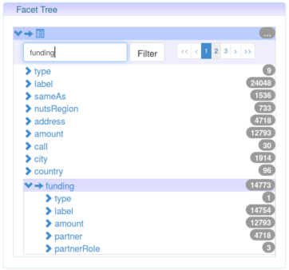
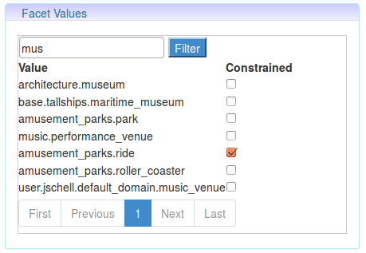
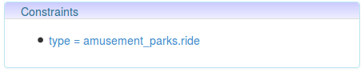
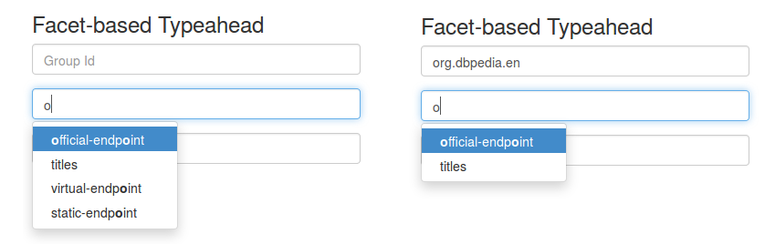
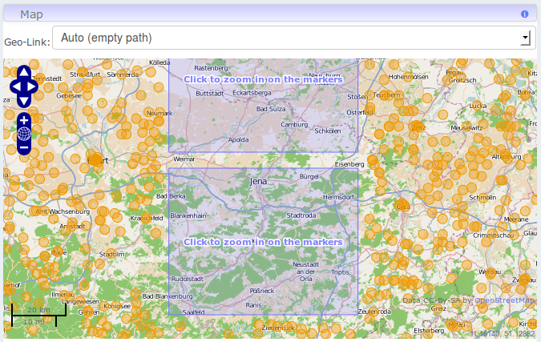

# Jassa-Angular-UI

This repository contains a set of reusable angularjs directives (widgets) for user interface components based on the [JAvaScript Suite for Sparql Access (Jassa)](https://github.com/GeoKnow/Jassa).
The widgets are designed to work _directly_ on a SPARQL endpoint and cope with large result sets by means of pagination support.


_Disclaimer: Please be aware that that this code base is under active development, and there are some differences between the screenshots and the current appearance. The repository layout and the build configuration are based on [angular-ui-bootstrap](https://github.com/angular-ui/bootstrap)._

## Components

### Facet Search
Jassa features out of the box SPARQL based faceted search over SPARQL accessible data.

Note: If case you are worried that SPARQL access might be too slow, you might be interested in our [jena-sparql-api](https://github.com/AKSW/jena-sparql-api) framework, which offers (among several utils) simple server side caching which can already boost the performance of recurring queries. We also plan to extend the project with more sophisticated caching soon.

Quick ugly [Demo](http://cstadler.aksw.org/jassa-ui/facet-components-demo/)

Faceted search components are configured and synchronized via the `FacetTreeConfig` object, which can be 'empty' on init:

```js
var rdf = jassa.rdf;
var facete = jassa.facete; 
var sparql = jassa.sparql;
var service = jassa.service;

var sparqlService = new service.SparqlServiceHttp('http://dbpedia.org/sparql', ['http://dbpedia.org']);

// Buff the service with client side pagination and caching support
sparqlService = new service.SparqlServiceCache(sparqlService);
sparqlService = new service.SparqlServicePaginate(sparqlService, 1000);

// By default, a facetTreeConfig instance will use the set of resources appearing in the triples' subject positions
// Set a baseConfig to use a custom set of resources
var facetTreeConfig = new facete.FacetTreeConfig();

// For the folowing boilerplate code we will add some utility function soon ;)
var baseElement = sparql.ElementString.create('?s a <http://dbpedia.org/ontology/Castle>');
var baseVar = rdf.NodeFactory.createVar('s');

var castles = new facete.Concept(baseElement, baseVar);

// The facetTreeConfig is now configured to the set of castles
facetTreeConfig.getFacetConfig().setBaseConcept(castles);

$scope.sparqlService = sparqlService;
$scope.facetTreeConfig = facetTreeConfig;
$scope.selectedPath = null;

// This function is used to sync the facet-value-list with the facet-tree
$scope.selectFacet = function(path) {
    $scope.selectedPath = path;
}
```

#### Facet Tree
A SPARQL-based data-driven widget for showing a (possibly) nested facet tree for a selected set of resources. Nodes in the tree feature support for regex search and pagination.



```html
<facet-tree
    sparql-service="sparqlService"
    facet-tree-config="facetTreeConfig"
    select="selectFacet(path)"
    plugins="facetTreePlugins"
    plugin-context="facetTreePluginContext">
</facet-tree>
```

#### Facet Value List
A SPARQL-based data-driven widget for showing the list of values for a given facet selection. Supports regex search and pagination.



```html
<facet-value-list
    sparql-service="sparqlService"
    facet-tree-config="facetTreeConfig"
    path="selectedPath">
</facet-value-list>
```

#### Constraint List
A widget which summarizes active constraints (which are part of the facetTreeConfig).



```html
<constraint-list
    sparql-service="sparqlService"
    facet-tree-config="facetTreeConfig">
</constraint-list>
```


#### Facet-based Typeahead
Want to link the autosuggestions of a set of input elements to facets? Check this out:



[Demo](http://cstadler.aksw.org/jassa-ui/facet-typeahead-demo/)

The left image shows all suggestions for the artifact id field, whereas the right
image only shows suggestions for the group id _org.dbpedia_. Note, that _titles_
appears as a search result, as by default the typeahead includes URIs in the search.

```js
// Set up the facet typeahead config (ftac)
$scope.ftac = {
    sparqlService: sparqlService,
    facetTreeConfig: facetTreeConfig
};

// Create a variable that acts as the model for the user input
// In our example, we assume the user entering a reference to a dataset
$scope.dataset = {
    desc: {
    }
};
```

```html
<input ng-model="dataset.desc.groupId" facet-typeahead="ftac" facet-typeahead-path="'http://dcat.cc/ontology/groupId'" type="text" placeholder="Group Id">

<input ng-model="dataset.desc.artifactId" facet-typeahead="ftac" facet-typeahead-path="'http://dcat.cc/ontology/artifactId'" type="text" placeholder="Artifact Id">

<input ng-model="dataset.desc.version" facet-typeahead="ftac" facet-typeahead-path="'http://dcat.cc/ontology/version'" type="text" placeholder="Version">
```

Above three elements will synchronize their autosuggestions based on the shared `ftac` configuration object.
Note that `facet-typeahead` reads out the `ng-model` attribute and will use the corresponding values to create SPARQL regex filters.
Technically, facet-typeahead replaces itself upon angular's linking phase with ui-bootstrap's [typeahead directive](http://angular-ui.github.io/bootstrap/).

### Map display
A map display based on (OpenLayers)[http://openlayers.org/] that works out of the box on a SPARQL endpoint. This includes DBpedia.
The map logic will use a tile based strategy for areas that would contain too much data.



[Demo](http://cstadler.aksw.org/jassa-ui/jassa-map-ol-demo/)


```js

// GeoMapFactory: An object that abstracts from a specific vocabulary.
// Bundles the capability to create SPARQL bounding box constraints for WKT-based vocabularies
// with the capability to extract geometric information from corresponding SPARQL result sets.
// Use geo.GeoMapFactoryUtils.wgs84MapFactory for wgs84 support
var geoMapFactory = geo.GeoMapFactoryUtils.createWktMapFactory(
    'http://www.w3.org/2003/01/geo/wgs84_pos#geometry',
    'bif:st_intersects',
    'bif:st_geomFromText');

$scope.mapConfig = {
	center: { lon: 50, lat: 50 },
	zoom: 8
};
                
$scope.dataSources = [{
	sparqlService: sparqlService,
	mapFactory: geoMapFactory,
	conceptFactory: new facete.ConceptFactoryConst(facete.ConceptUtils.createSubjectConcept(rdf.NodeFactory.createVar('s'))),
    quadTreeConfig: {
		maxItemsPerTileCount: 2500,
		maxGlobalItemCount: 100
	}
}];
```

```html
<div
    jassa-map-ol="map"
    style="position: absolute; left: 0px; top: 0px; width: 100%; height: 100%; z-index:-9999"
    config="mapConfig"
    sources="active.dataSources"
    select="selectGeom(data)"
    unselect="unselectGeom(data)">
</div>
```

### Utility directives

#### pointer-events-scrollfix
When using divs for layouting with pointer-events disabled and overflow set to auto, you will notice that the scrollbars on chrome
won't be clickable.
This directive will set _pointer-events:auto_ when scrollbars become visible.

```html
<div
    style="position: absolute; top: 50px; left: 0px; width: 500px; bottom: 0px; overflow: auto; pointer-events:none"
    pointer-events-scroll-fix>
</div>
```

#### resizable
A wrapper for jQuery UI's resizable.
To be documented.


## Demo

See the widgets in action [here](http://cstadler.aksw.org/jassa-ui/).
_The stylistic aspect is work in progress :)_


## Usage

You can install jassa-ui-angular with the bower package managager using

    bower install jassa-ui-angular

This will checkout the latest version (by git tag) from our [bower release repository](https://github.com/GeoKnow/Jassa-UI-Angular-Bower).

HTML tags for the dependencies can be injected into a file using the `bower-install` grunt task.

    grunt bower-install

For some dependencies bower-install task does not know what to add to your HTML file due to lack of metadata. Manually add the following elements to your `index.html` or main file.

    <link rel="stylesheet" href="css/jassa-ui-angular.css" />
    <script src="bower_components/jscache/cache.js"></script>
    <script src="bower_components/underscore.string/lib/underscore.string.js"></script>


Note: [This issue](https://github.com/angular-ui/bootstrap/issues/1791) causes Angular-UI-Bootstrap v0.10.0 to throw an exception when using expressions for the active state of tabs. The issue seems to be fixed in master, but there is no bower release yet. Hence, you need to fall back to this [slightly modified version](https://github.com/GeoKnow/Jassa-UI-Angular/blob/master/jassa-ui-angular-core/demo/facet-tree/app/lib/angular-ui/0.10.0/ui-bootstrap-tpls-0.10.0.js).


    <script src="lib/angular-ui/0.10.0/ui-bootstrap-tpls-0.10.0.js"></script>

## Build

Make sure that a current version `npm` is available on your system.
You can install `npm` using:

```bash
# Remove or purge old versions
sudo apt-get remove nodejs npm
sudo add-apt-repository ppa:chris-lea/node.js
sudo apt-get update
sudo apt-get install nodejs
# The nodejs package includes the npm command
```

Install development tools (-g indicates to install them globally on your system rather than the current working directory)

```bash
sudo npm install -g grunt-cli
sudo npm install -g bower
```

Run the build script

```bash
cd jassa-ui-angular-core
./build.sh
```

## Project layout

* `jassa-ui-angular-core`: Module for core widgets which do not depend on other user interface libraries except for angular-ui-bootstrap.
* `jassa-ui-angular-geo-openlayers`: Module for openlayer widgets. WIP.

## License
To be clarified (some liberal one, such as MIT or Apache v2)

